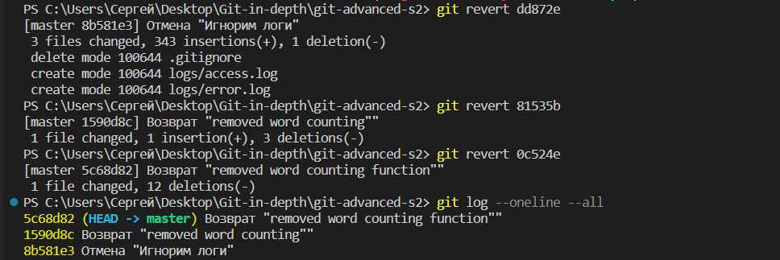
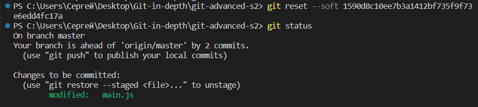
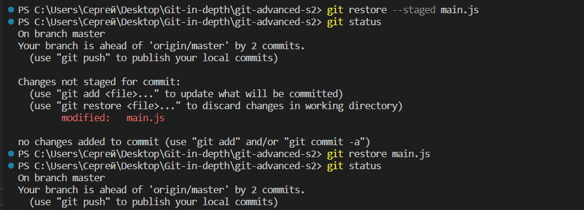
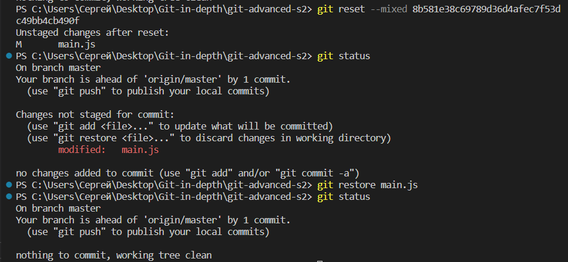
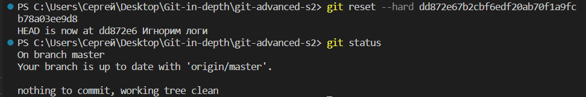
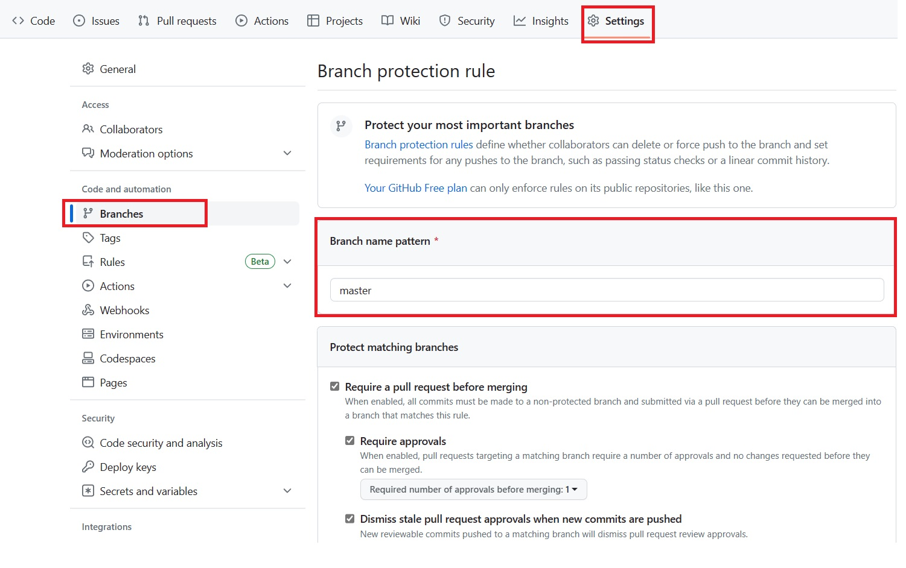
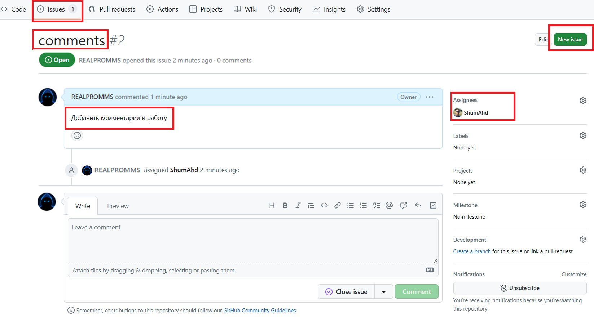
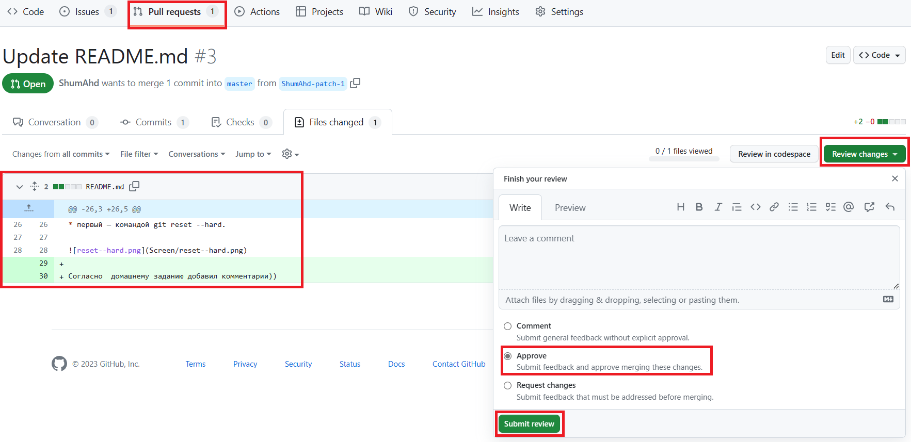
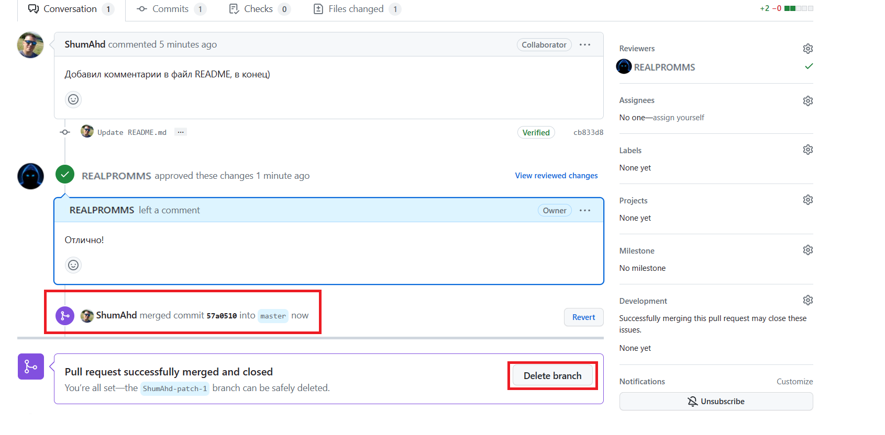

# Контроль версий углублённо (GIT) (семинары)

## Урок 2. Работа с изменениями

1. Просмотрите историю коммитов в своём проекте и выберите три случайных коммита. Просмотрите изменения, которые были в них сделаны.

2. Верните эти изменения командой git revert последовательно, чтобы в итоге получилось тоже три коммита.

3. Попробуйте отменить эти три коммита:

* последний — командами git reset --soft и git restore;

* предпоследний — командой git reset --mixed и git restore;

* первый — командой git reset --hard.

## Урок 3. Практики и инструменты для работы с Git

1. Пригласите в свой проект кого-то из коллег по обучению, дайте им доступ к своему репозиторию (кроме ветки master).

Защита ветки master

Добавляем в проект коллег

2. Поставьте ему в GitHub задачу по своему проекту, попросите её выполнить в отдельной ветке, а после выполнения — создать pull request и перевести задачу обратно на вас.

3. Проверьте выполнение задачи, примите pull request и удалите ветку, в которой решалась данная задача.

Проверка и принятие изменений

Удаление лишней ветки

Согласно  домашнему заданию добавил комментарии))